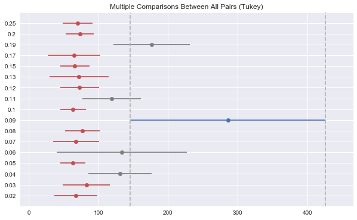
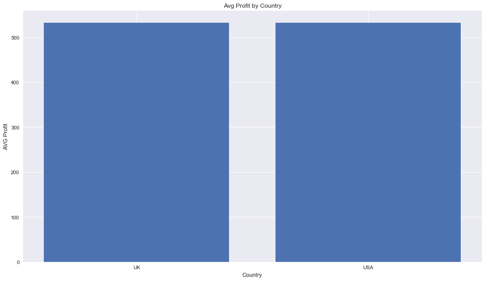
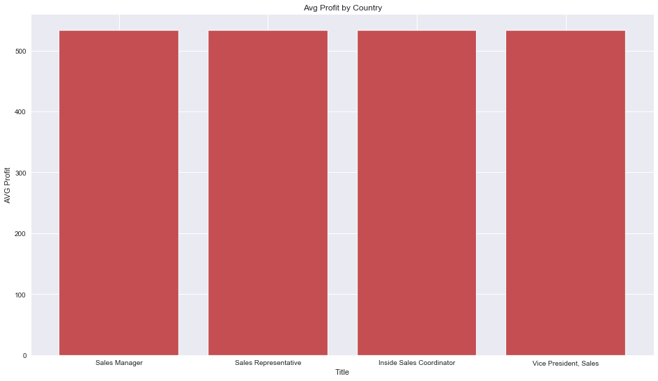

# Northwind Project by Jacob Tadesse

## Introduction

Northwind is a specialty food distributor, with employees in the United States and United Kingdom. The board of directors of Northwind would like to determine operational success and employee performance to justify expansion. The board chair has tasked the CEO with auditing  sales and employee data housing in the company's `Northwind_small` database. 

## Objectives

The CEO of Northwind has hired my consultancy to answer the following quesitons based on the data:

- <b>Initial Question:</b> *Does discount amount have a statistically significant effect on the quantity of a product in an order? If so, at what level(s) of discount?*
- <b>Second Question:</b> *Are US employees generating the same profit on average as UK employees?*
- <b>Third Question:</b> *On average, are our teams generating more profit from inside sales or outside sales in the US?*
- <b>Final Question:</b> *Are all employees generating equal revenue over time?*

## The Project

For this project, I worked with the `Northwind database`--a free, open-source dataset created by Microsoft containing data from a fictional company. I also used a .py file with a few one-sample and two-sample statistical tests saved in the `Test.Stats` directory.

`import tools.stats as t
from tools.stats import *
help(t)`

### Northwind Schema

## The Results

The entire experiment with statistical test can be found in the `Northwind.ipynb` Notebook in this repository. My results are below:

- <b>Initial Question:</b> *Does discount amount have a statistically significant effect on the quantity of a product in an order? If so, at what level(s) of discount?*
    - On average, customers order quantity increases at around 9%. Our *recommendation* around order discounts would be to create a campaign for 9% discounts to current and future customers in the selected area of expansion. This targeted campaign will significantly increase order quantity, in any new regions or territories of expansion.
    
    

- <b>Second Question:</b> *Are US employees generating the same profit on average as UK employees?*
    - On average, we do not see a significant difference in profit generation between countries. Our *recommendation* would be to expand offices in other regions to replicate the profit generated from teams in the US and the UK.  
    

- <b>Third Question:</b> *On average, are our teams generating more profit from inside sales or outside sales in the US?*
    - On average, we do not see a significant difference in revenue generatation between inside and outside teams. Our *recommendation* would be to expand teams in other regions to replicate the profit generated from inside and outside sales in the US and the UK.     
    

- <b>Final Question:</b> *Are all employees generating equal revenue over time?*
    - On an average day, we see significant difference in average profit generatation between employees. Our *recommendation* would be to promote Anne Dodsworth from Sales Representative to Sales Manager for new regions to replicate her daily profit average of roughly $645 per day, in her past experience in the British Isles, UK.
    
